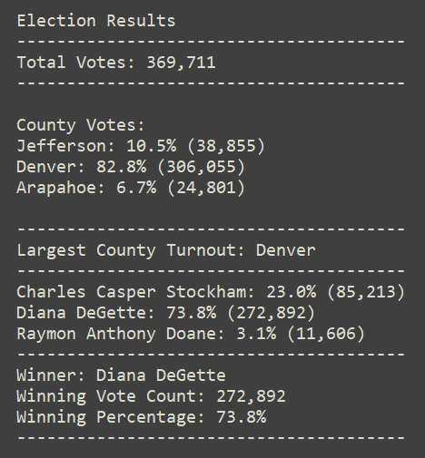

# Election Analysis

## Project Overview/Goals
### The Colorado Board of Elections has provided the following tasks to complete the election audit of a recent local congressional election:
  1. Calculate the total number of votes cast
  2. Calculate the voter turnout and percentage of votes for each county
  3. Determine the county with the highest turnout
  4. Get a complete list of candidates who received votes
  5. Calculate the total number and percentage of votes each candidate received
  7. Determine the winner based on popular vote
  
 The as shown in the above goals, the purpose of this election audit was to revile the winner of the election by popular vote, calculate each candidate’s election results, and determine the overall and relative turnout of voters of the involved counties.

## Resources
  * Data source: [election_results.csv](Resources/election_results.csv)
  * Software: Python 3.10.1, Visual Studio Code 1.63.2

## Election Audit Results
The analysis of the election is shown in the image here:

As we can see, this image covers all of the project’s goals:

* Total Votes: 369,711
* There were **three** counties involved in the election, each with their relative turnouts and percentages
	* Jefferson county had 10.5% of the vote with a turnout of 38,855
	* Denver county had 82.8% of the vote with a turnout of 306,055
	* Arapahoe county had 6.7% of the vote with a turnout of 24,801
* The county with the highest turnout:
	* **Denver**
* There were **three** candidates that received votes in the election
	* Charles Casper Stockham
	* Diana DeGette
	* Raymon Anthony Doane
* The results for each candidate:
	* Charles Casper Stockham received 23.0% of the votes with 85,213 in total
    * Diana DeGette received 73.8% of the votes with 272,892 in total
    * Raymon Anthony Doane received 3.1% of the votes with 11,606 in total
* The winner of the election by popular vote was: 
	* **Diana DeGette!**

## Election Audit Summary

This script was written so that it could be applicable to almost any other elections in the future, making it very versatile and flexible. Each of the counties and candidates’ names were taken directly from the data and placed in virtual "lists/dictionaries" that tracked vote counts. This would allow the script to be used in situations with many more counties and candidates than the ones in this election without needing to change the code, as long as the data source is formatted and organized the same.

The code could also be slightly modified to add more information, like the specific winner of each county for example, if popular vote is not the deciding factor for winning.

The code additionally could also be slightly modified to allow for state wide or even federal/national elections with the addition of a lists/dictionaries for states that would in turn encompass the counties that have already been written out in this code.

These two examples show how, even with a few modifications, this code could be very widely and confidently used in almost any election going forward.
